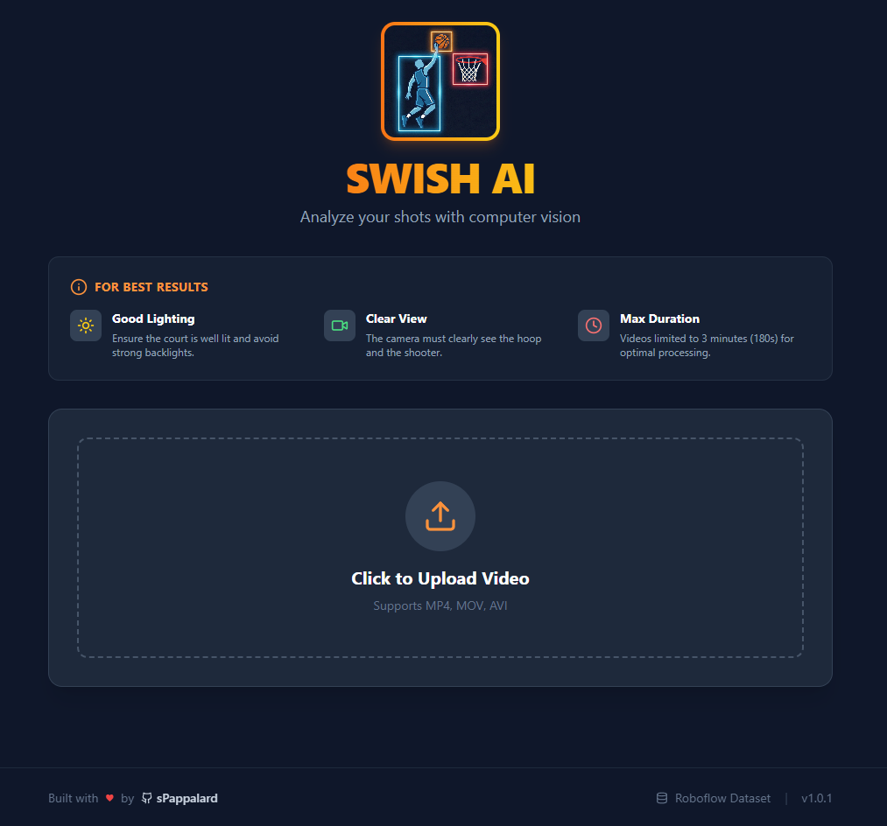
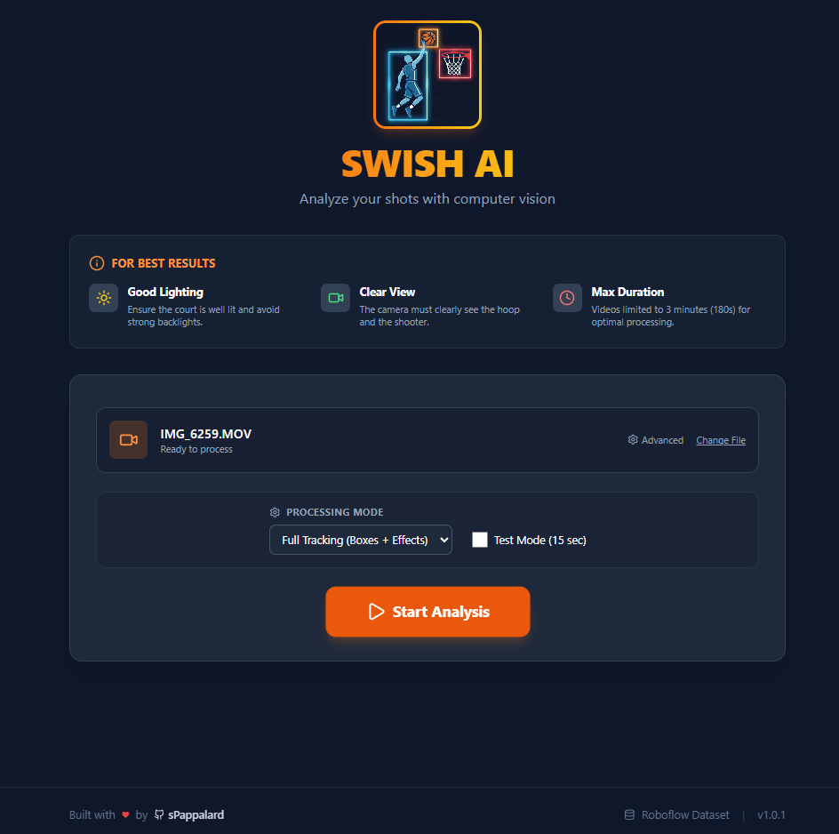
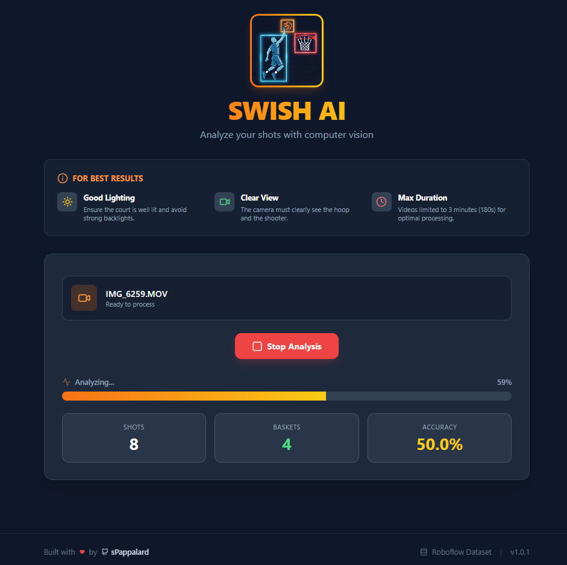
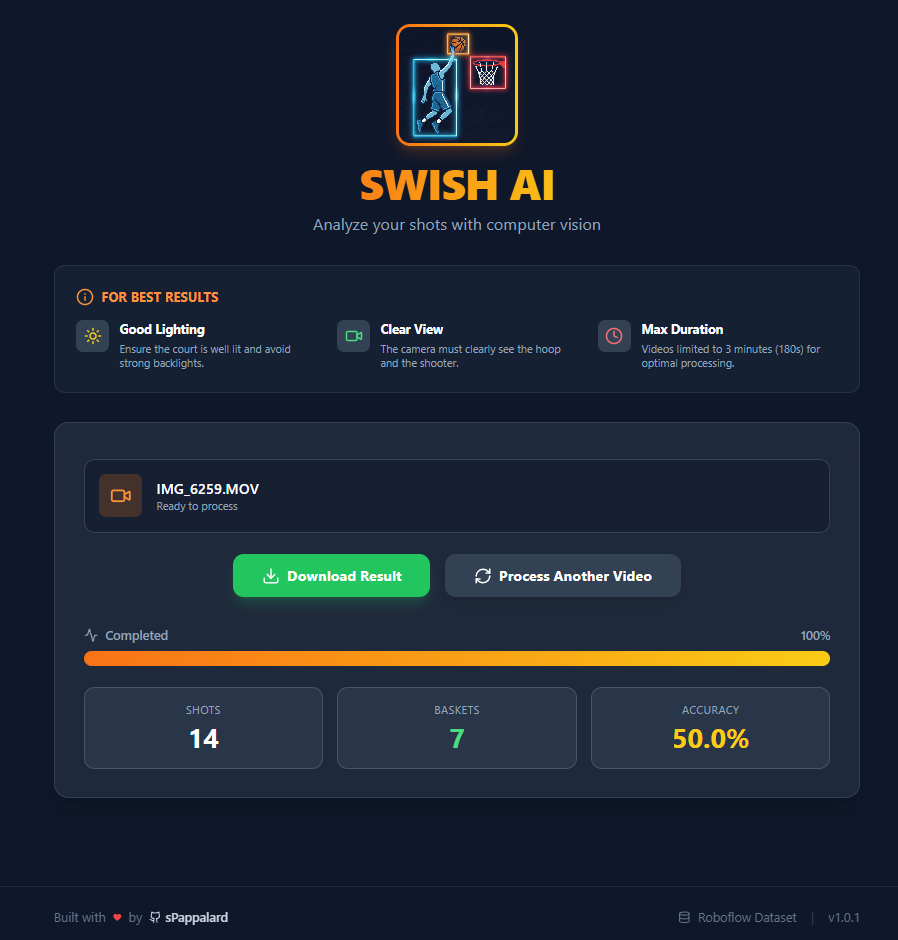
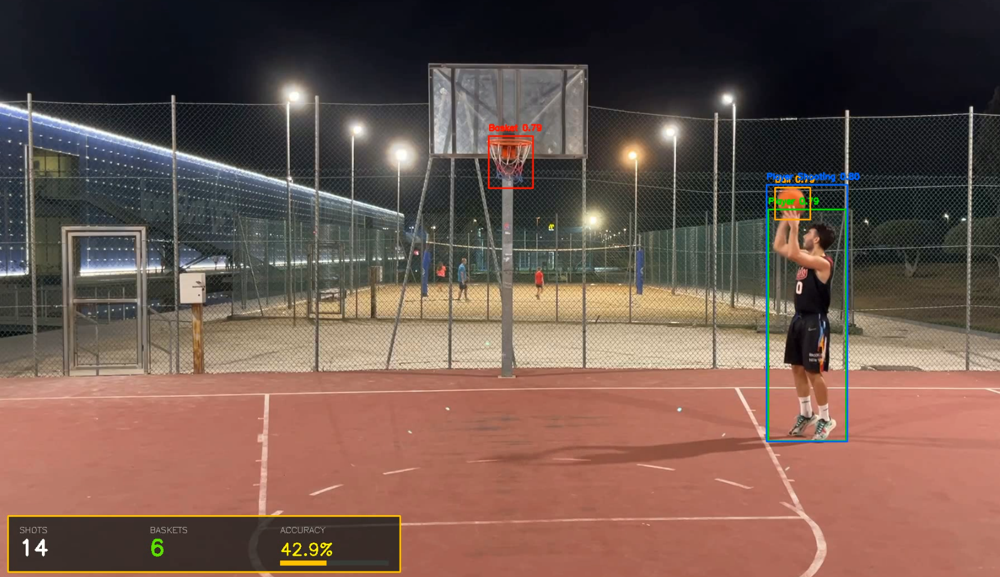

<div align="center">
  
</div>

# 🏀 SwishAI - Basketball Shot Analysis & Tracking

SwishAI is a state-of-the-art Computer Vision application designed to analyze basketball shots from video footage automatically. Powered by YOLOv11 and a modern React + FastAPI stack, it tracks players, basketballs, and hoops in real-time, calculating shooting percentage and visualizing successful shots with dynamic overlays.

---

## 📋 Table of Contents

- [Key Features](#-key-features)
- [Tech Stack](#-tech-stack)
- [Project Architecture](#-project-architecture)
- [Installation & Setup](#️-installation--setup)
  - [Dataset & Model Training](#1-dataset--model-training)
  - [Backend Setup](#2-backend-setup)
  - [Frontend Setup](#3-frontend-setup)
- [Usage Guide](#-usage-guide)
- [Technical Logic & AI](#-technical-logic--ai)
- [Screenshots](#-screenshots)
- [Credits](#-credits)

---

## ✨ Key Features

- **Advanced Object Detection**: Detects 5 distinct classes: Ball, Ball in Basket, Player, Basket, and Player Shooting.
- **Smart Scoring System**: Automatically counts shots attempted vs. made to calculate real-time Field Goal Percentage (FG%).
- **Visual FX**: Renders dynamic "pulse" animations and overlays when a basket is scored.
- **Configurable AI**: Users can adjust Confidence Thresholds for each class via the UI to adapt to different lighting conditions.
- **Processing Modes**:
  - **Full Tracking**: Bounding boxes + Visual Effects + HUD.
  - **Stats & Effects**: Clean view with only scoring effects and HUD.
  - **Stats Only**: Minimalist overlay.
- **Performance Optimization**: Includes a "Test Mode" (processes only 15s) and auto-cleanup mechanisms to manage server storage.

---

## 🛠 Tech Stack

### Artificial Intelligence
- **YOLOv11s** (Ultralytics): Latest SOTA object detection model
- **PyTorch**: Deep learning framework
- **OpenCV (cv2)**: Video processing and drawing logic
- **NumPy**: Matrix operations for game logic

### Backend (BE)
- **FastAPI**: High-performance, asynchronous Python web framework
- **Uvicorn**: ASGI server implementation
- **Threading**: Background video processing handling

### Frontend (FE)
- **React 18**: UI Library
- **Vite**: Next-generation frontend tooling
- **Tailwind CSS**: Utility-first CSS framework for styling
- **Lucide React**: Modern icon set

---

## 📂 Project Architecture

```
SwishAI/
├── BE/                           # Backend (Python)
│   ├── basketball_training/      # Training scripts & artifacts
│   │   ├── weights/              # Stores best.pt after training
│   │   └── data_basketball.yaml  # Dataset configuration
│   ├── processed/                # Output videos (Auto-cleaned)
│   ├── uploads/                  # Raw user uploads (Auto-cleaned)
│   ├── app.py                    # FastAPI Server & Business Logic
│   ├── train_model.py            # YOLO Training Script
│   └── requirements.txt          # Python dependencies
├── FE/                           # Frontend (React)
│   ├── src/                      # Source code
│   │   └── App.jsx               # Main UI Component
│   ├── public/                   # Static assets
│   ├── tailwind.config.js        # Tailwind configuration
│   └── package.json              # Node dependencies
└── README.md
```

---

## ⚙️ Installation & Setup

### Prerequisites

- Python 3.10+
- Node.js 18+ & npm
- NVIDIA GPU (Optional but highly recommended for training/inference)

### 1. Dataset & Model Training

Before running the app, you need to train the model (or use pre-trained weights).

**Download Dataset**: Get the basketball detection dataset from [Roboflow Universe](https://universe.roboflow.com/basketball-6vyfz/basketball-detection-srfkd).

**Configure Training**:
- Ensure the dataset is extracted into `BE/basketball-detection-srfkd-1`
- Check `train_model.py` config class:

```python
DATASET_DIR = Path("basketball-detection-srfkd-1")
EPOCHS = 200
BATCH_SIZE = 8  # Adjust based on your VRAM
```

**Run Training**:

```bash
cd BE
python train_model.py
```

This script handles auto-validation, GPU checks, and custom augmentation.

### 2. Backend Setup

Navigate to the backend directory:

```bash
cd BE
```

Create and activate a virtual environment:

```bash
python -m venv venv

# Windows:
.\venv\Scripts\activate

# Mac/Linux:
source venv/bin/activate
```

Install dependencies:

```bash
pip install -r requirements.txt
```

Start the API server:

```bash
python app.py
```

Server will run at `http://localhost:8000`.

### 3. Frontend Setup

Navigate to the frontend directory:

```bash
cd FE
```

Install packages:

```bash
npm install
```

Start the development server:

```bash
npm run dev
```

Client will run at `http://localhost:5173`.

---

## 🚀 Usage Guide

1. **Open the App**: Go to the local frontend URL.
2. **Upload Video**: Click the upload area to select a basketball video (MP4, MOV, AVI).
3. **Configure Settings** (Optional):
   - **Processing Mode**: Choose between Full Tracking or Stats Only.
   - **Advanced Settings**: Click "Advanced" to tweak confidence thresholds for specific classes (e.g., lower "Ball" threshold for dark videos).
   - **Test Mode**: Check "Test Mode" to process only the first 15 seconds.
4. **Start Analysis**: Click the Start Analysis button. You will see a real-time progress bar and stats updating as the backend processes the video.
5. **Download**: Once complete, download the rendered video with overlays.

---

## 🧠 Technical Logic & AI

### Physics & Cooldowns

To prevent double-counting, the system implements physics-based cooldown logic (`app.py`):

- **Shot Cooldown (1.5s)**: Prevents the model from registering multiple shots for a single throwing motion.
- **Basket Cooldown (2.0s)**: Ensures the ball swishing through the net isn't counted twice in consecutive frames.

### Custom Augmentation Strategy

The training script (`train_model.py`) uses specialized augmentation for sports footage:

- **HSV Saturation (0.7)**: Helps detect orange balls in varied lighting.
- **Shear (2.0°)**: Improves robustness against camera angles.
- **Mixup (0.15)**: Helps separating players in crowded scenes.

### Classes

| ID | Class Name       | Default Confidence |
|----|------------------|--------------------|
| 0  | Ball             | 0.60               |
| 1  | Ball in Basket   | 0.25               |
| 2  | Player           | 0.70               |
| 3  | Basket           | 0.70               |
| 4  | Player Shooting  | 0.77               |

---

## 📸 Screenshots

### Main Interface
<div align="center">
  
  <p><em>Upload interface with processing mode selection</em></p>
</div>

### Advanced Model Settings
<div align="center">
  
  <p><em>Fine-tune confidence thresholds for each detection class</em></p>
</div>

### Ready to Process
<div align="center">
  
  <p><em>Video uploaded and ready for analysis</em></p>
</div>

### Processing in Progress
<div align="center">
  
  <p><em>Real-time progress tracking with live statistics updates</em></p>
</div>

### Processing Complete
<div align="center">
  
  <p><em>Analysis finished - ready to download the processed video</em></p>
</div>

### Output Example
<div align="center">
  
  <p><em>Example of processed video with tracking overlays and statistics</em></p>
</div>

### 🎥 Sample Output Video

Watch a full demonstration of SwishAI in action:

<div align="center">
  <a href="https://www.youtube.com/watch?v=jlCniC-61_w">
    
  </a>
  <p><em>Click the image above to watch the demo on YouTube</em></p>
</div>

**[▶️ Watch on YouTube](https://www.youtube.com/watch?v=jlCniC-61_w)**

---

## 📜 Credits

- **Developer**: sPappalard
- **Dataset**: [Roboflow Universe - Basketball Detection](https://universe.roboflow.com/basketball-6vyfz/basketball-detection-srfkd)
- **Frameworks**: Ultralytics YOLO, FastAPI, React

### Dataset Citation

```bibtex
@misc{
    basketball-detection-srfkd_dataset,
    title = { Basketball detection Dataset },
    type = { Open Source Dataset },
    author = { basketball },
    howpublished = { \url{ https://universe.roboflow.com/basketball-6vyfz/basketball-detection-srfkd } },
    url = { https://universe.roboflow.com/basketball-6vyfz/basketball-detection-srfkd },
    journal = { Roboflow Universe },
    publisher = { Roboflow },
    year = { 2025 },
    month = { mar },
    note = { visited on 2025-11-30 },
}
```

Made with ❤️ and Python.