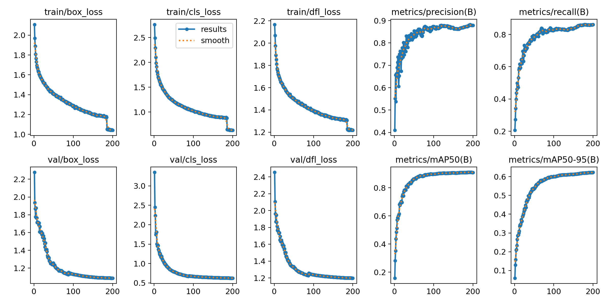
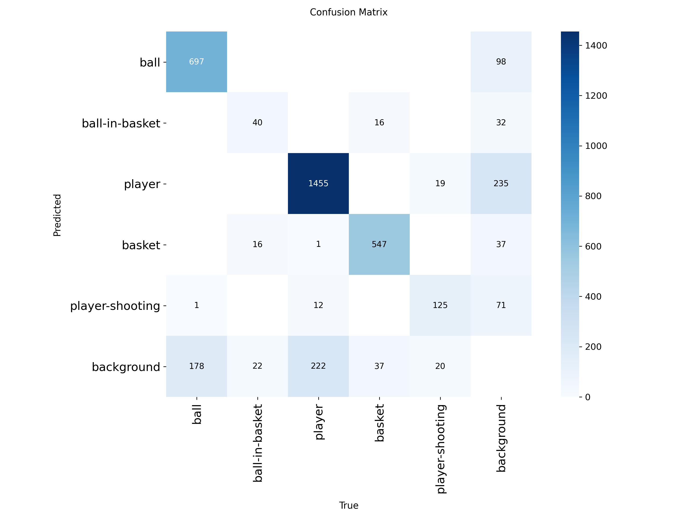
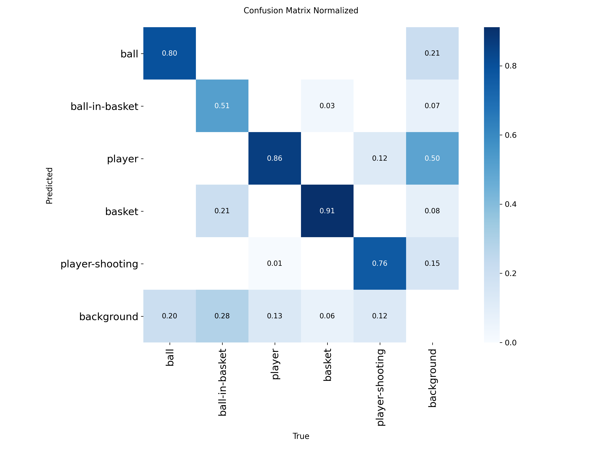
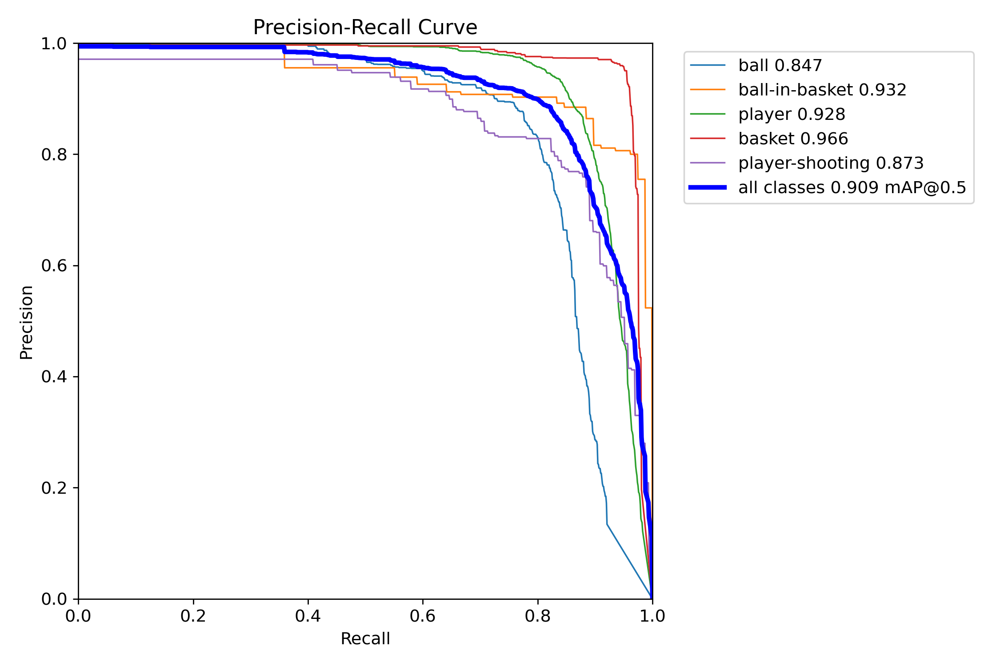
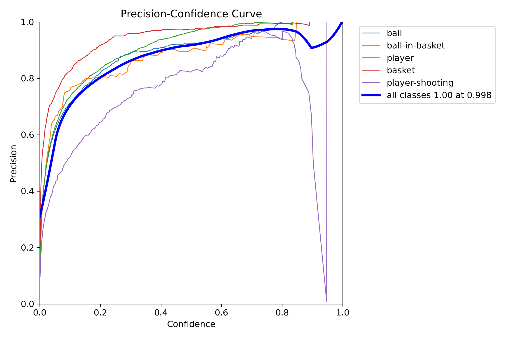
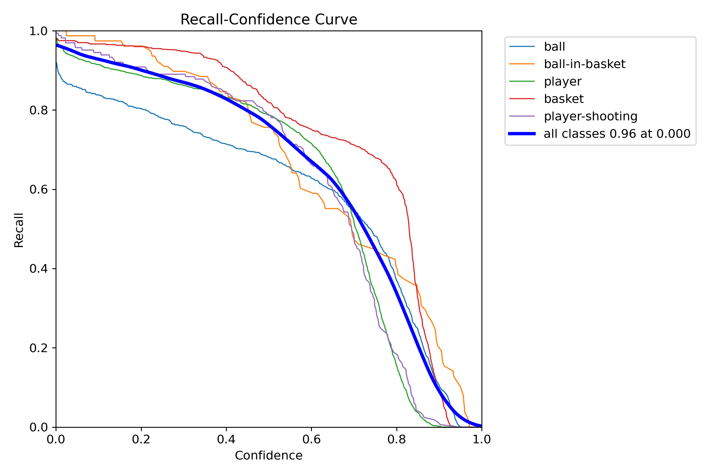
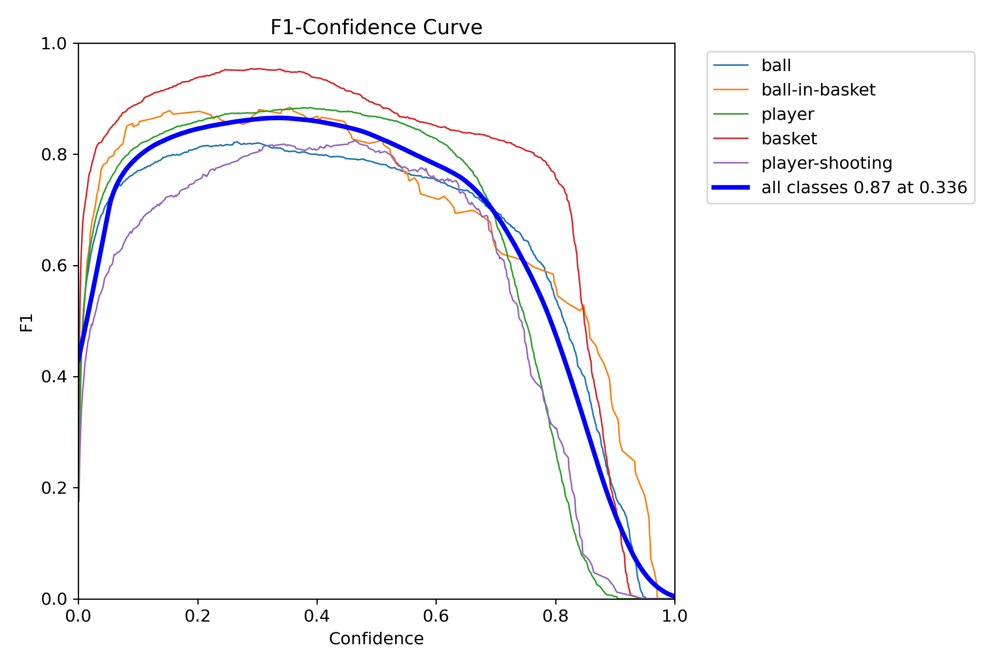

<div align="center">
  
</div>

# 🏀 SwishAI - Basketball Shot Analysis & Tracking

SwishAI is a Computer Vision application designed to analyze basketball shots from video footage automatically. Powered by YOLOv11 and a modern React + FastAPI stack, it tracks players, basketballs, and hoops in real-time, calculating shooting percentage and visualizing successful shots with dynamic overlays.

---

## 📋 Table of Contents

- [Key Features](#-key-features)
- [Screenshots](#-screenshots)
- [Usage Guide](#-usage-guide)
- [Tech Stack](#-tech-stack)
- [Project Architecture](#-project-architecture)
- [Installation & Setup](#️-installation--setup)
  - [Prerequisites](#prerequisites)
  - [Backend Setup](#1-backend-setup)
  - [Frontend Setup](#2-frontend-setup)
  - [Dataset & Model Training](#3-dataset--model-training)
- [Technical Logic & AI](#-technical-logic--ai)
  - [Physics & Cooldowns](#physics--cooldowns)
  - [Custom Augmentation Strategy](#custom-augmentation-strategy)
  - [Detection Classes](#detection-classes)
- [Model Training & Performance](#-model-training--performance)
  - [Dataset Information](#dataset-information)
  - [Training Configuration](#training-configuration)
  - [Model Performance Metrics](#model-performance-metrics)
  - [Precision-Recall Curves](#precision-recall-curves)
  - [Training Script Details](#training-script-details)
- [Credits](#-credits)
- [License](#license)

---

## ✨ Key Features

- **Advanced Object Detection**: Detects 5 distinct classes: Ball, Ball in Basket, Player, Basket, and Player Shooting.
- **Smart Scoring System**: Automatically counts shots attempted vs. made to calculate real-time Field Goal Percentage (FG%).
- **Visual FX**: Renders dynamic "pulse" animations and overlays when a basket is scored.
- **Configurable AI**: Users can adjust Confidence Thresholds for each class via the UI to adapt to different lighting conditions.
- **Processing Modes** - the video can be processed with 3 different modes:
  - **Full Tracking**: Bounding boxes + Visual Effects + HUD.
  - **Stats & Effects**: Clean view with only scoring effects and HUD.
  - **Stats Only**: Minimalist overlay.
- **Performance Optimization**: Includes a "Test Mode" (processes only the first 15s) and auto-cleanup mechanisms to manage server storage.

---

## 📸 Screenshots

### Main Interface
<div align="center">
  
  <p><em>Upload interface with processing mode selection</em></p>
</div>

### Advanced Model Settings
<div align="center">
  
  <p><em>Fine-tune confidence thresholds for each detection class</em></p>
</div>

### Ready to Process
<div align="center">
  
  <p><em>Video uploaded and ready for analysis</em></p>
</div>

### Processing in Progress
<div align="center">
  
  <p><em>Real-time progress tracking with live statistics updates</em></p>
</div>

### Processing Complete
<div align="center">
  
  <p><em>Analysis finished - ready to download the processed video</em></p>
</div>

### Output Example
<div align="center">
  
  <p><em>Example of processed video with tracking overlays and statistics</em></p>
</div>

### 🎥 Sample Output Video

Watch a full demonstration of SwishAI in action:

<div align="center">
  <a href="https://www.youtube.com/watch?v=jlCniC-61_w">
    
  </a>
  <p><em>Click the image above to watch the full video output on YouTube</em></p>
</div>

**[▶️ Watch on YouTube](https://www.youtube.com/watch?v=jlCniC-61_w)**

---

## 🚀 Usage Guide

1. **Open the App**: Go to the local frontend URL.
2. **Upload Video**: Click the upload area to select a basketball video (MP4, MOV, AVI).
3. **Configure Settings** (Optional):
   - **Processing Mode**: Choose between Full Tracking, Stats & Effects or Stats Only.
   - **Advanced Settings**: Click "Advanced" to tweak confidence thresholds for specific classes (e.g., lower "Ball" threshold for dark videos).
   - **Test Mode**: Check "Test Mode" to process only the first 15 seconds. Useful to check if the model works properly.
4. **Start Analysis**: Click the Start Analysis button. You will see a real-time progress bar and stats updating as the backend processes the video.
5. **Download**: Once complete, download the rendered video with overlays.

---

## 🛠 Tech Stack

### Computer Vision & AI Core
- **YOLOv11s** (Ultralytics): Latest SOTA object detection model
- **PyTorch**: Deep learning framework
- **OpenCV (cv2)**: Video processing and drawing logic
- **NumPy**: Matrix operations for game logic

### Backend (BE)
- **FastAPI**: High-performance, asynchronous Python web framework
- **Uvicorn**: ASGI server implementation
- **Threading**: Background video processing handling

### Frontend (FE)
- **React 18**: UI Library
- **Vite**: Next-generation frontend tooling
- **Tailwind CSS**: Utility-first CSS framework for styling
- **Lucide React**: Modern icon set

---

## 📂 Project Architecture

```
SwishAI/
├── BE/                           # Backend (Python)
│   ├── basketball_training/      # Training scripts & artifacts
│   │   ├── weights/              # Stores best.pt after training
│   │   └── data_basketball.yaml  # Dataset configuration
│   ├── processed/                # Output videos (Auto-cleaned)
│   ├── uploads/                  # Raw user uploads (Auto-cleaned)
│   ├── app.py                    # FastAPI Server & Business Logic
│   ├── train_model.py            # YOLO Training Script
│   └── requirements.txt          # Python dependencies
├── FE/                           # Frontend (React)
│   ├── src/                      # Source code
│   │   └── App.jsx               # Main UI Component
│   ├── public/                   # Static assets
│   ├── tailwind.config.js        # Tailwind configuration
│   └── package.json              # Node dependencies
└── README.md
```

---

## ⚙️ Installation & Setup

### Prerequisites

- Python 3.10+
- Node.js 18+ & npm
- NVIDIA GPU (Optional but highly recommended for training/inference)

### 1. Backend Setup

Navigate to the backend directory:

```bash
cd BE
```

Create and activate a virtual environment:

```bash
python -m venv venv

# Windows:
.\venv\Scripts\activate

# Mac/Linux:
source venv/bin/activate
```

Install dependencies:

```bash
pip install -r requirements.txt
```

Start the API server:

```bash
python app.py
```

Server will run at `http://localhost:8000`.

### 2. Frontend Setup

Navigate to the frontend directory:

```bash
cd FE
```

Install packages:

```bash
npm install
```

Start the development server:

```bash
npm run dev
```

Client will run at `http://localhost:5173`.

### 3. Dataset & Model Training

Before running the app, you need to train the model (or use pre-trained weights).

**Download Dataset**: Get the basketball detection dataset from [Roboflow Universe](https://universe.roboflow.com/basketball-6vyfz/basketball-detection-srfkd).

**Configure Training**:
- Ensure the dataset is extracted into `BE/basketball-detection-srfkd-1`
- Check `train_model.py` config class (the script is tailored for my hardware: GTX 1060 6GB - i7 6700k - 16gb ram):

```python
DATASET_DIR = Path("basketball-detection-srfkd-1")
EPOCHS = 200
BATCH_SIZE = 8  # Adjust based on your VRAM
```

**Run Training**:

```bash
cd BE
python train_model.py
```

This script handles auto-validation, GPU checks, and custom augmentation.

---

## 🧠 Technical Logic & AI

### Physics & Cooldowns

To prevent double-counting, the system implements physics-based cooldown logic (`app.py`):

- **Shot Cooldown (1.5s)**: Prevents the model from registering multiple shots for a single throwing motion.
- **Basket Cooldown (2.0s)**: Ensures the ball swishing through the net isn't counted twice in consecutive frames.

### Custom Augmentation Strategy

The training script (`train_model.py`) uses specialized augmentation for sports footage:

- **HSV Saturation (0.7)**: Helps detect orange balls in varied lighting.
- **Shear (2.0°)**: Improves robustness against camera angles.
- **Mixup (0.15)**: Helps separating players in crowded scenes.

### Detection Classes

| ID | Class Name       | Default Confidence |
|----|------------------|--------------------|
| 0  | Ball             | 0.60               |
| 1  | Ball in Basket   | 0.25               |
| 2  | Player           | 0.70               |
| 3  | Basket           | 0.70               |
| 4  | Player Shooting  | 0.77               |

---

## 📊 Model Training & Performance

### Dataset Information

SwishAI uses a custom-trained YOLOv11s model trained on the **Basketball Detection Dataset** from Roboflow Universe.

- **Dataset Source**: [Roboflow Universe - Basketball Detection](https://universe.roboflow.com/basketball-6vyfz/basketball-detection-srfkd)
- **Dataset Size**: ~10,000 annotated images
- **License**: CC BY 4.0
- **Classes**: 5 (Ball, Ball in Basket, Player, Basket, Player Shooting)
- **Training Date**: March 17, 2025

### Training Configuration

The model was trained using a custom training script (`train_model.py`) specifically optimized for consumer-grade hardware:

**Hardware Specifications:**
```
- GPU: NVIDIA GTX 1060 6GB
- CPU: Intel i7-6700K
- RAM: 16GB DDR4
- Training Duration: ~48 hours continuous
```

**Training Parameters:**
- **Model**: YOLOv11s (small variant for efficiency)
- **Epochs**: 200
- **Batch Size**: 8 (optimized for 6GB VRAM)
- **Image Size**: 640x640
- **Optimizer**: AdamW
- **Learning Rate**: 0.001 (with cosine decay)

### Model Performance Metrics

<div align="center">

#### Training & Validation Loss Curves


#### Confusion Matrix


#### Normalized Confusion Matrix


</div>

**Key Performance Indicators** (Final Model - Epoch 200):
- **mAP50**: 0.909 (Mean Average Precision at IoU 0.5)
- **mAP50-95**: 0.623 (Mean Average Precision from IoU 0.5 to 0.95)
- **Overall Precision**: 0.878
- **Overall Recall**: 0.861

**Per-Class Performance:**
| Class | Precision | Recall | mAP50 |
|-------|-----------|--------|-------|
| Ball | 0.80 | 0.88 | 0.847 |
| Ball in Basket | 0.51 | 0.36 | 0.932 |
| Player | 0.86 | 0.85 | 0.928 |
| Basket | 0.91 | 0.91 | 0.966 |
| Player Shooting | 0.76 | 0.34 | 0.873 |

### Precision-Recall Curves

<div align="center">









</div>

### Training Script Details

The `train_model.py` script includes:
- **Hardware-specific optimizations** for GTX 1060 6GB (batch size, workers, memory management)
- **Custom augmentation pipeline** tailored for basketball footage (HSV saturation, shear, mixup)
- **Automatic validation split** (80/20 train/val)
- **Early stopping** and checkpoint saving
- **Mixed precision training** (FP16) for faster training on limited VRAM

> **Note on Model Improvement**: The current model achieves strong performance for real-time basketball analysis. However, further improvements are possible through:
> - Extended training (300+ epochs)
> - Larger model variants (YOLOv11m or YOLOv11l)
> - Additional data augmentation techniques
> - Fine-tuning on specific court environments
> - Ensemble methods or model fusion
> 
> Users with more powerful hardware (RTX 3080+, 24GB+ VRAM) can modify the training parameters in `train_model.py` to achieve higher accuracy.

---

## 📜 Credits

- **Developer**: sPappalard
- **Dataset**: [Roboflow Universe - Basketball Detection](https://universe.roboflow.com/basketball-6vyfz/basketball-detection-srfkd)
- **Frameworks**: Ultralytics YOLO, FastAPI, React

### Dataset Citation

```bibtex
@misc{
    basketball-detection-srfkd_dataset,
    title = { Basketball detection Dataset },
    type = { Open Source Dataset },
    author = { basketball },
    howpublished = { \url{ https://universe.roboflow.com/basketball-6vyfz/basketball-detection-srfkd } },
    url = { https://universe.roboflow.com/basketball-6vyfz/basketball-detection-srfkd },
    journal = { Roboflow Universe },
    publisher = { Roboflow },
    year = { 2025 },
    month = { mar },
    note = { visited on 2025-11-30 },
}
```

---

## License

This project is licensed under the MIT License - [](https://opensource.org/licenses/MIT)

